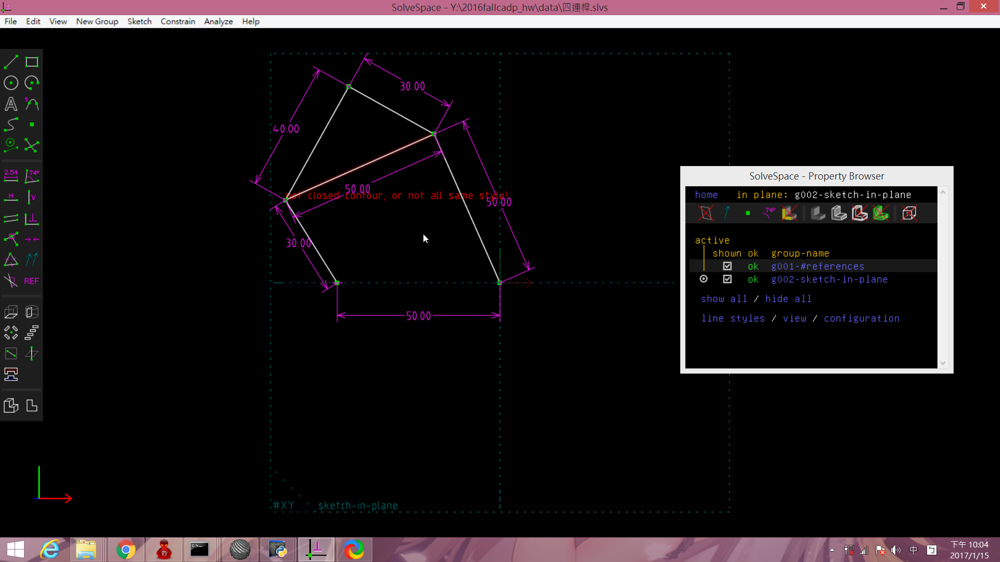
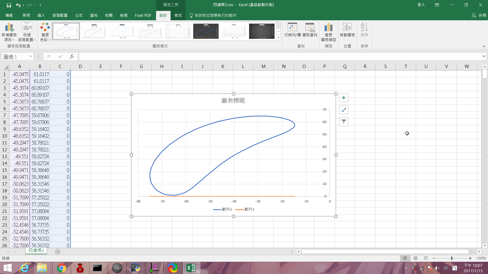

Title: 40423133 課程總結
Date: 2016-10-6 11:00
Category: HW
Tags: 作業
Author: 40423133

<!-- PELICAN_END_SUMMARY -->

###上課筆記

1.下載mini2016fall.7z工具

2.到mdecourse的2016fallCADP點擊fork

3.建立自己的作業倉儲，組長還須建立2016fallcadp_ag8倉儲

4.在倉儲建立gh-pages分支

5.將組別倉儲clone下來，切換到gh-pages分支

6.使用git submodule add -b gh-pages 指令將組員的作業倉儲加入子模組

7.每周定時使用

(1) git submodule init

(2)git submodule update和

(3)git submodule foreach "(git checkout gh-pages; git pull)&"來更新

8.設定shareX的儲存位置

(1)Application settings

(2)path選擇想儲存的位置即可

9.使用solvespace練習繪製零件

###零件繪製

<iframe width="560" height="315" src="https://www.youtube.com/embed/5EdLQnqd8PU" frameborder="0" allowfullscreen></iframe>

###四連桿

Solvespace 四連桿圖

<a href="./../w7/四連桿.csv"> 四連桿.csv</a> (請以滑鼠右鍵存檔)

<a href="./../w7/四連桿.slvs">四連桿.slvs</a> (請以滑鼠右鍵存檔)

###四連桿-2

<iframe width="560" height="315" src="https://www.youtube.com/embed/5kP5zsb9p38" frameborder="0" allowfullscreen></iframe>

<!-- 導入 brython.js -->

<!-- 啟動 brython() -->

<!-- 以下利用 Brython 程式執行繪圖 -->

<canvas id="fourbar" width="600" height="600"></canvas>

###solvespace練習

1.parts(零件繪製)

範例檔案: http://solvespace.com/bracket.pl An introductory tutorial is available, in which we draw the same part that is shown in the demo video.

This covers most of the basic features of SolveSpace, including sketches, constraints, extrusions, and Boolean operations.

When we first run SolveSpace, we will begin with an empty part. Initially, our view of the part will be oriented onto the XY plane; the label for that plane is displayed at the bottom left of the screen (#XY, in dark grey). The axes are also indicated by the three colored arrows at the bottom left; the X, Y, and Z axes are drawn in red, green, and blue respectively.

When we hover the mouse over any entity, constraint, or other object in the sketch, that object will appear highlighted in yellow. For example, the XY plane, which is drawn as a dashed square, will appear highlighted when we hover the mouse over it. The YZ and ZX planes initially look like dashed lines, because they are being viewed on edge; but they still appear highlighted in yellow when we hold the mouse over them. It is similarly possible to highlight the X, Y, and Z axes (which are drawn as arrows), or the origin (which like all points is drawn as a green square).

Extrude(平行長出)

<iframe src="./../data/長出.html"width="800"height="600"/></iframe>

Extrude (除料)

<iframe src="./../data/除料.html"width="800"height="600"/></iframe>

Lathe (旋轉繞行長出或除料)

<iframe src="./../data/環繞.html"width="800"height="600"/></iframe>

<iframe width="560" height="315" src="https://www.youtube.com/embed/Thos_zDqEx4" frameborder="0" allowfullscreen></iframe>

<iframe width="560" height="315" src="https://www.youtube.com/embed/j12mmas0tL4" frameborder="0" allowfullscreen></iframe>

<iframe width="560" height="315" src="https://www.youtube.com/embed/fNTrXUZXMVI" frameborder="0" allowfullscreen></iframe>

 2. Assembly (零件組立)

<iframe src="./../data/箱子盒子.html"width="1000"height="600"/></iframe>

<iframe width="560" height="315" src="https://www.youtube.com/embed/mh5Gij-yq5M" frameborder="0" allowfullscreen></iframe>

 3. Linkages (fourbar & multilink) (四連桿與多連桿運動模擬)

<iframe width="560" height="315" src="https://www.youtube.com/embed/-AhsfYmta3s" frameborder="0" allowfullscreen></iframe>

###solvespace作業

零件
<iframe src="./../data/方塊零件.html"width="800"height="600"/></iframe>

<iframe src="./../data/桿子.html"width="800"height="600"/></iframe>

<iframe width="560" height="315" src="https://www.youtube.com/embed/6hO9R-bqvDY" frameborder="0" allowfullscreen></iframe>

<iframe width="560" height="315" src="https://www.youtube.com/embed/0xvCrweLttk" frameborder="0" allowfullscreen></iframe>

成品
<iframe src="./../data/方塊組合完成品.html"width="800"height="600"/></iframe>

<iframe width="560" height="315" src="https://www.youtube.com/embed/IbmJoYIZdXs" frameborder="0" allowfullscreen></iframe>

###印表機

零件

<iframe src="./../data/底盤.html"width="800"height="600"/></iframe>

<iframe src="./../data/長桿.html"width="800"height="600"/></iframe>

<iframe src="./../data/短桿.html"width="800"height="600"/></iframe>

<iframe src="./../data/噴嘴.html"width="800"height="600"/></iframe>

完成品

<iframe src="./../data/3D印表機.html"width="800"height="600"/></iframe>

<iframe width="560" height="315" src="https://www.youtube.com/embed/VwyJuAA2TIQ" frameborder="0" allowfullscreen></iframe>

<iframe width="560" height="315" src="https://www.youtube.com/embed/c1njl1SFV3E" frameborder="0" allowfullscreen></iframe>

###onshape組裝

<iframe width="560" height="315" src="https://www.youtube.com/embed/TsGSko12k_k" frameborder="0" allowfullscreen></iframe>

  

